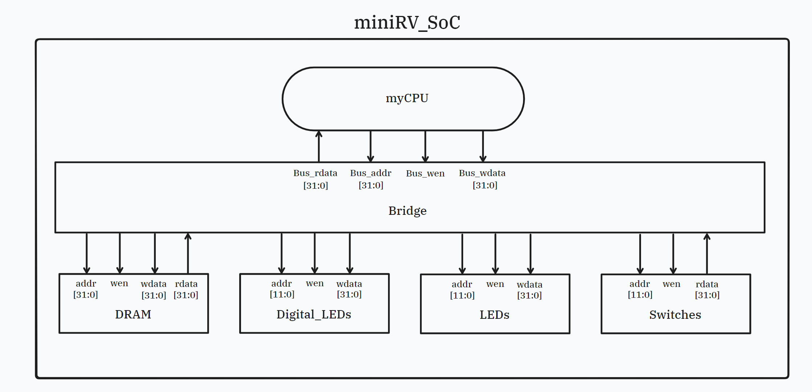
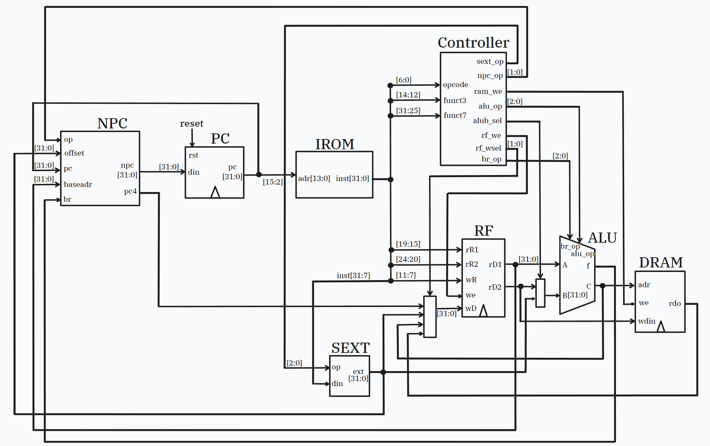
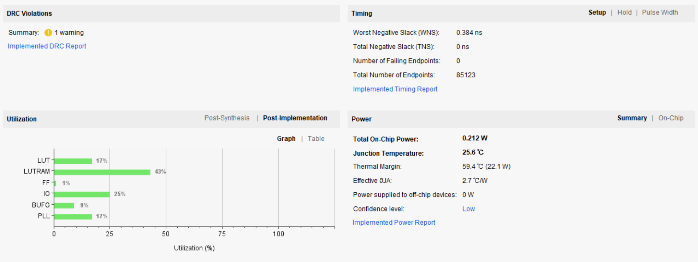
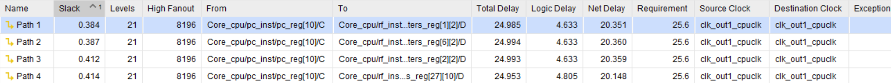
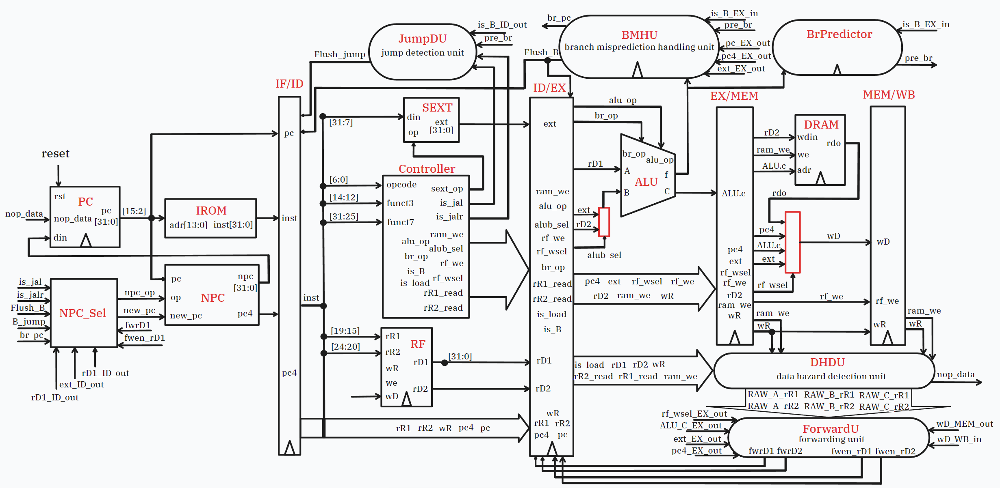
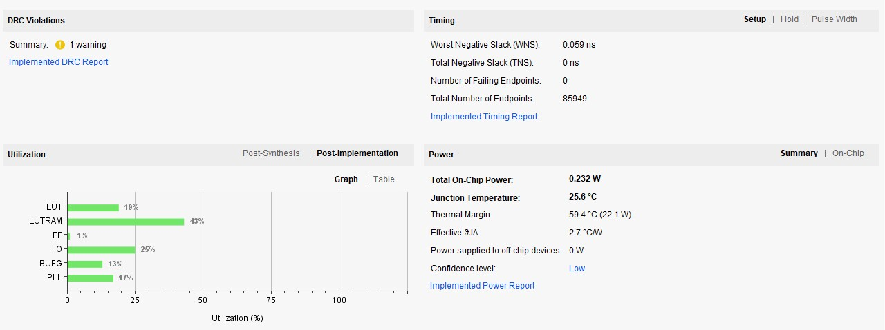
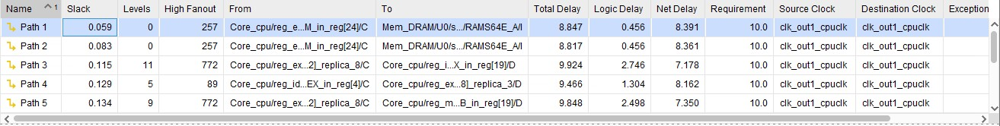
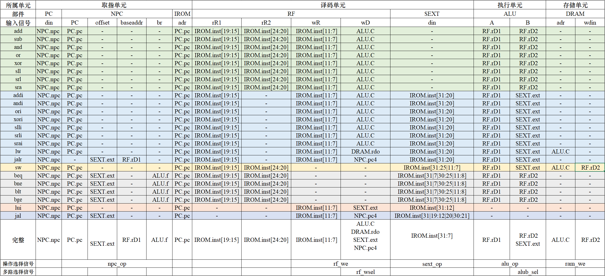
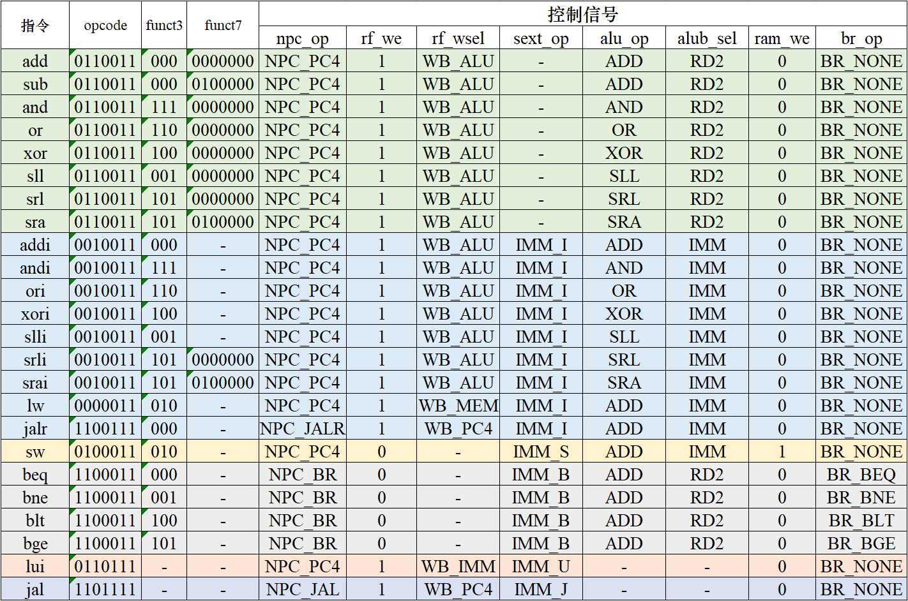

# 1 说明

本项目是基于`miniRV`的SoC设计，`miniRV` 是`RISC-V R32I` 指令集的子集，本项目总体设计图如下

在 `miniRV_SoC ` 中，CPU通过总线对统一编制的DRAM (data ram) 和外设进行读写。总线无复用，依靠译码单元在DRAM和外设进行单独读写，无需仲裁。

项目的主体和主要设计为CPU，本项目分别实现了单周期CPU和经典五级流水线CPU，支持**R**型指令 `add, sub, and, or, xor, sll, srl, sra` 、**I**型指令 `addi, andi, ori, xori, slli, srli, srai, lw, jalr `；**S**型指令 `sw`、**B**型指令 `beq, bne, blt, bge` 、**U**型指令 `lui` 以及 **J** 型指令 `jal`。

# 2 单周期实现

## 2.1 CPU主频与功率

CPU主频达 $39 \mathrm{MHz}$，功率 $0.212 \mathrm{W}$

# 3 流水线实现

## 3.1 CPU主频与功率

CPU主频达 $100 \mathrm{MHz}$，功率 $0.232 \mathrm{W}$

## 3.2 冒险处理

设计思路及代码可见 [冒险处理设计方案](./pipeline/HazardSolutionDesign.md)

# 4 Tips

先设计，再实现。项目的核心是完成CPU的设计，而非实现。以单周期为例，可借助表格分析功能部件对每条指令进行的操作，完成下图

分析每种功能部件需要进行的操作种类，设计控制信号，如下图

设计落实到代码实现上很快，代码量也不大。以本项目实现来说，单周期代码行数约1200行，流水线代码行数约2200行，但大部分代码都属于接线，实例化类。完整且正确的设计会为你节约很多时间，本项目的单周期的实现用时约1天，而流水线的实现则用时约5天。在实现流水线时，由于流水线的部分部件设计仍然继承了单周期时的框架，诸多细节未正确设计，导致debug和重构代码时间较长。

以下是本项目进行时遇到的较大的两个问题，你也可能会遇到：

1. `NPC` 的设计

   由于 `npc_op ` 以及 `pc`、`ext` 等值ID阶段才能确定，所以单周期的设计已经无法满足要求。实现无条件跳转指令时，计算 `npc ` 需要用ID阶段的，此时IF阶段的 `npc` 一定是错的，因此要清空IF/ID寄存器清空，停顿一个流水线周期。在综合考虑了B型指令后，增加了`NPC_Sel` ，重构了 `NPC` 。这部分无法继承单周期时的框架，需重新设计。

2. 数据前递的考量

   除了ALU的输入会用到前递，`sw`指令也会用到`rD2`，`jalr` 指令也会用到`rD1` 。在前递数据和使能信号时，这两部分也要被充分考虑。如果前递连接到ID/EX寄存器中，则建议将`ALUB_MUX` 放在EX阶段，否则在实现`sw`指令时可能因前递相关问题而导致写入地址错误。

