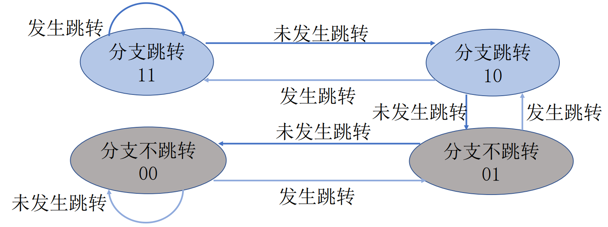

# 数据冒险


```verilog
//PC.v
else if (nop_data)
         pc <= pc;

//REG_IF_ID.v
else if (nop_data)
         pc_ID_in <= pc_ID_in;
```


# 控制冒险

对于B型指令，若预测为跳转，则其处理可以被视作无条件跳转指令，若预测为不跳转，则被视为最普通的指令。分支跳转的预测由`BrPredictor.v` 分支预测器完成，采用2-bit动态分支预测。



当预测错误时，由 `BMHU.v` 分支预测错误处理单元检测出并完成流水线的清空与停顿。

```verilog
reg pre_br_ex;

always @(posedge cpu_clk or posedge cpu_rst) begin
  if (cpu_rst)
     pre_br_ex <= 1'b0;
  else 
     pre_br_ex <= pre_br;
end

assign Flush_B = is_B && (pre_br_ex != real_br); 
assign br_pc = real_br? (pc_EX_out + ext_EX_out) : pc4_EX_out;
```

为匹配上ID阶段与EX阶段的时钟差，分支预测错误处理单元内置的寄存器`pre_br_ex` 中储存的预测信号会比分支预测器中给的信号慢一个时钟周期。对比实际跳转信号和预测跳转信号后可判断出是否分支预测错误，并输出清空信号 `Flush_B` 和正确的分支地址 `br_pc`。

清空信号 `Flush_B` 连接到了 `REG_IF_ID.v`和 `REG_ID_EX.v `用于清空并停顿两个周期的流水线

```verilog
//REG_IF_ID.v
else if (Flush_B || Flush_jump) 
         inst_ID_in <= 32'h0;

//REG_ID_EX.v
else if (Flush_B || nop_data)
         ram_we_EX_in <= 1'b0;
```

清空信号 `Flush_B` 和正确的分支地址 `br_pc` 连接到了 `NPC_Sel.v` ，恢复流水线运行

```verilog
//NPC_Sel.v
if (Flush_B) 
         new_pc = br_pc;
...
assign npc_op = is_jal || is_jalr || Flush_B || B_jump;

//NPC.v
always @(*) begin
    case (op)  //npc_op
        `NPC_new:   npc = new_pc;
        ...
    endcase  
end
```


# 无条件跳转指令停顿

无条件跳转指令的跳转地址需要在ID阶段才能计算出来，因此需要清空并停顿一个周期的流水线。此外，被预测要跳转的B型指令可视为无条件跳转指令，在跳转检测单元 `JumpDU.v` 中被一并处理。

```verilog
assign Flush_jump = is_jal || is_jalr || B_jump;
assign B_jump = is_B && pre_br;
```

`Flush_jump` 连接到 `REG_IF_ID.v ` 中，清空并停顿一周期的流水线

```verilog
else if (Flush_B || Flush_jump) 
         inst_ID_in <= 32'h0;
```

给 `NPC.v` 赋值，恢复流水线运行的部分与控制冒险相似

```verilog
//NPC_Sel.v
else if (is_jal || B_jump) 
	new_pc = pc_ID_in + ext_ID_out;
else if (is_jalr)
    if (forward_en_rD1) 
    	new_pc = forward_rD1 + ext_ID_out;
    else
    	new_pc = rD1_ID_out + ext_ID_out;
```


